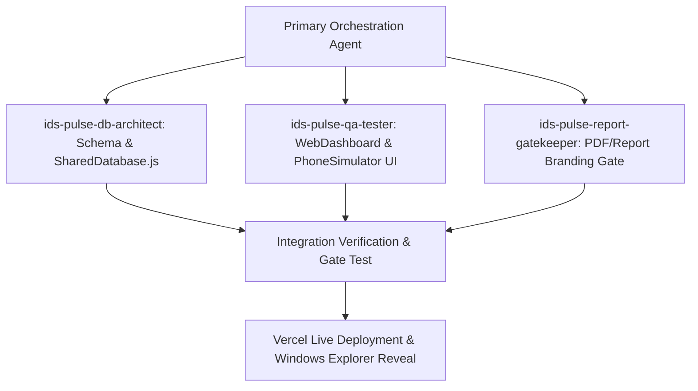

# Antigravity Agent Manager — IDS Pulse Architecture Skill

This skill provides project-specific orchestration guidelines for managing autonomous subagents and background tasks within the **IDS Pulse** enterprise quality platform.

---

## 1. IDS Pulse Specialized Subagent Roster

When decomposing tasks in the IDS Pulse codebase, define and spawn specialized subagent roles tailored to our system architecture:

### A. `ids-pulse-qa-tester` (UI & E2E Testing Specialist)
- **Role**: Executes Puppeteer live DOM scripts, captures authentic browser screenshots, and audits UI layouts.
- **Rules Enforced**:
  - Validates high-contrast light theme (`bg-white`, `text-slate-900`, contrast > 7:1).
  - Verifies zero dark container tints (`bg-amber-950`, `bg-slate-900`) inside light dashboard surfaces.
  - Takes authentic live screenshots of running app (NO AI generated mockups).

```json
{
  "name": "ids-pulse-qa-tester",
  "description": "Runs Puppeteer end-to-end user flow scripts and verifies UI high-contrast standards in IDS Pulse",
  "system_prompt": "You are the IDS Pulse QA Specialist. Run node verification scripts (e.g. capture_authentic_live_app.cjs), capture screenshots, and confirm zero UI contrast violations.",
  "enable_write_tools": true,
  "enable_mcp_tools": true,
  "enable_subagent_tools": false
}
```

### B. `ids-pulse-report-gatekeeper` (PDF & Branding Auditor)
- **Role**: Audits human-readable reports (PDF, HTML, Excel) for branding compliance.
- **Rules Enforced**:
  - Runs `node tests/report_branding_and_layout_gate.test.js` before completing report edits.
  - Verifies 100% presence of canonical base64 logo (`LOGO_BASE64` in `src/config/brandingConfig.js`).
  - Enforces ZERO text truncation (`doc.splitTextToSize` for multiline wrapping) and ZERO emojis.

```json
{
  "name": "ids-pulse-report-gatekeeper",
  "description": "Verifies PDF invoice/report branding, base64 logos, multiline text wrapping, and zero-truncation rules",
  "system_prompt": "You are the IDS Pulse Report Gatekeeper. Validate all PDF export templates, run report gate tests, and ensure canonical Base64 logo and zero text truncation rules.",
  "enable_write_tools": true,
  "enable_mcp_tools": true,
  "enable_subagent_tools": false
}
```

### C. `ids-pulse-db-architect` (Supabase & Data Pipeline Specialist)
- **Role**: Manages SQL migrations, RLS security policies, dynamic schema getters, and multi-role filtering.
- **Rules Enforced**:
  - Enforces `supplier_id` as the single canonical client key across `shiftReports`, `reworkLogs`, `projects`, and `users`.
  - Implements 3-Way Supplier Contact Resolution (contacts array, supplier table fields, and customer role users).
  - Resolves currency dynamically by plant location (US $\rightarrow$ USD, Canada $\rightarrow$ CAD).

### D. `ids-pulse-mobile-builder` (Android Native APK Specialist)
- **Role**: Compiles Android native builds (`build_native_apk.ps1`), verifies APK checksums, and handles binaries safely.
- **Rules Enforced**:
  - ZERO Binary IDE Tab Open: Never open `.apk`, `.pdf`, or `.zip` files in IDE editor tabs.
  - Automatically reveals generated APKs in Windows Explorer via `explorer.exe /select,"idspulse-app.apk"`.

---

## 2. IDS Pulse Guardrail Integration for Subagents

All delegated subagents MUST strictly adhere to the project's permanent guardrails defined in `AGENTS.md`:

1. **Sole Super-Admin Protection**:
   - Shahroz Mirza (`shahroz`) is the ONLY unalterable System Super-Admin.
   - Password is strictly locked to `Shahroz121$`. Subagents are strictly forbidden from modifying or exposing credentials.
2. **Role Separation (IDS Rep vs Client Rep)**:
   - **IDS Rep**: IDS Field Inspectors (e.g. Clarence Kuiken) assigned to plant floor projects.
   - **Client Rep**: Client Quality Managers & Overtime Approvers (e.g. Robert Sterling, Elena Rostova).
   - `isFieldRep()` MUST exclude customer/client roles (`role === 'customer' || role === 'client'`).
3. **Automotive Onboarding Mandatory Fields**:
   - Every project onboarding workflow MUST capture: (1) PO Number, (2) Suspect Part Number, (3) Client Contact Phone/Email, (4) Dynamic Plant Location & City. Zero dummy city fallbacks allowed.
4. **Zero Emoji Rule**:
   - Emojis are strictly forbidden across UI, buttons, modals, PDF reports, code, and response texts. Use `lucide-react` SVG icons only.

---

## 3. Parallel Execution Workflow for IDS Pulse Features

When tasked with a major feature or bug fix in IDS Pulse, follow this multi-agent workflow:



1. **Decompose Task**: Divide work into Database/API layer, Frontend UI components, and Reporting/PDF exports.
2. **Invoke Subagents**: Launch subagents concurrently using `invoke_subagent` with `Workspace: 'inherit'`.
3. **Reactive Wait**: Inform the user and yield execution (end turn). Do not poll status in a loop.
4. **Audit & Deploy**: When notifications arrive, run `npm run build` and `node tests/report_branding_and_layout_gate.test.js` before deploying live to Vercel.
