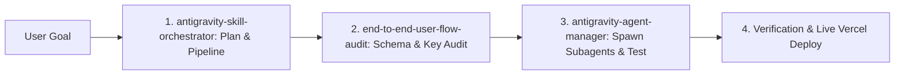

# Antigravity Skill Orchestrator — Architecture & Pipeline Skill

This skill guides the primary agent on discovering, chaining, synthesizing, and executing modular agent skills within **Google Antigravity** and the **IDS Pulse** platform.

---

## 1. Skill Discovery & Precedence Resolution

When presented with a complex engineering goal, the Skill Orchestrator scans available skill registries and resolves priorities in the following order (from highest to lowest precedence):

```
1. Workspace Project Skills (.agents/skills/<name>/SKILL.md)
2. Declared Workspace Configurations (skills.json)
3. Global User Skills (~/.gemini/config/skills/<name>/SKILL.md)
4. Built-in Antigravity System Skills
```

### Precedence Rules:
- If a project skill shares the same name as a global or built-in skill, the **workspace project skill overrides** lower-priority skills.
- Use **Progressive Disclosure**: Only activate a skill's full `SKILL.md` file when its trigger conditions match the user's intent to conserve token context.

---

## 2. Skill Chaining & Pipeline Execution

For multi-step engineering tasks, chain specialized skills into an execution pipeline:



### Chaining Example Workflow:
1. **Audit Phase**: Activate `end-to-end-user-flow-audit` to verify `supplier_id` canonical keys, role separation (`isFieldRep`), and 3-way contact matching.
2. **Orchestration Phase**: Activate `antigravity-agent-manager` to spawn parallel subagents (`ids-pulse-qa-tester`, `ids-pulse-report-gatekeeper`).
3. **Verification Phase**: Run `npm run build` and `node tests/report_branding_and_layout_gate.test.js`.

---

## 3. Dynamic Skill Synthesis & Authoring Protocol

When encountering a new recurring engineering pattern, synthesize a new skill following these standards:

### Standard Skill Directory Structure:
```text
.agents/skills/<skill_name>/
├── SKILL.md          # Required: Main instruction file with YAML frontmatter
├── scripts/          # Optional: Helper verification & automation scripts
├── examples/         # Optional: Code snippets and reference patterns
└── references/       # Optional: Detailed architecture & domain manuals
```

### Authoring Rules for `SKILL.md`:
1. **Valid YAML Frontmatter**: Must include `name` (lowercase, hyphenated) and `description` (third-person explanation of *what* it does and *when* to use it).
2. **Actionable Playbooks**: Provide clear, numbered step-by-step procedures with code snippets and commands.
3. **Verification Commands**: Always include concrete verification steps (e.g. `npm test`, Puppeteer scripts, report gate tests).
4. **Zero Duplication**: Keep `SKILL.md` focused strictly on specialized domain runbooks; delegate bulky reference materials to `references/`.

---

## 4. IDS Pulse Skill Registry Overview

The project currently maintains the following active skills in `.agents/skills/`:

| Skill Name | Location | Primary Purpose |
| :--- | :--- | :--- |
| **`antigravity-skill-orchestrator`** | `.agents/skills/antigravity-skill-orchestrator/SKILL.md` | Skill discovery, chaining, pipeline execution, and skill synthesis |
| **`antigravity-agent-manager`** | `.agents/skills/antigravity-agent-manager/SKILL.md` | Multi-agent delegation, subagent lifecycle management, and background scheduling |
| **`end-to-end-user-flow-audit`** | `.agents/skills/end-to-end-user-flow-audit/SKILL.md` | Multi-role user flow verification (`Rep` $\rightarrow$ `Admin` $\rightarrow$ `Client`) |
