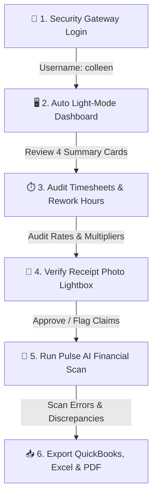

# 📘 IDS Pulse Operations Suite — Complete Accountant Master Handbook

Welcome to the **Complete Accountant Master Operating Handbook** for **IDS Pulse Operations Suite**! This manual is the definitive guide for Accountants (**Colleen's Role**) to manage payroll, audit field timesheets, verify expense claims, calculate plant billing, run AI audits, and export corporate financial ledgers.

---

## 🎨 1. Master Infographic & Workflow Overview

### 📊 End-to-End Financial Lifecycle

---

## 🔑 2. Login, Portal Access & Security Scoping

### 👤 Credentials & Interface
- **Portal URL**: [https://proud-lavoisier.vercel.app](https://proud-lavoisier.vercel.app)
- **Username**: `colleen`
- **Password**: `Colleen2026!`
- **UI Theme**: Automatically forces **High-Contrast Light Mode** (`#ffffff` background with slate borders).

---

## 📊 3. Metric Cards & Calculation Formulas

| Metric | Underlying Data Source | Mathematical Formula | Purpose |
| :--- | :--- | :--- | :--- |
| **Total Billable Hours** | QRE Time Entries | `Σ (Shift Hours x Rate Multiplier)` | Customer Billing & QRE Payroll |
| **Mileage Reimbursement** | QRE Travel Distance Logs | `Total Distance (km) x $0.65/km` | QRE Travel Compensation |
| **Verified Expenses** | Approved Expense Claims | `Fuel + Tolls + Parking + Meals` | Reimbursable Out-of-Pocket |
| **Grand Invoice Total** | Consolidated Accounts | `(Hours x Rate) + Mileage + Expenses` | Client Invoicing & Payroll |

---

## ⏱️ 4. Timesheet Auditing & Multi-Supplier Allocation

- **Shift Verification**: Confirm clock-in/out timestamps match plant shift rosters.
- **Supplier Filter**: Filter entries by Supplier (Auto Kabel, Magna, Hutchinson, Brose).
- **Manager Bulk Entry**: Log or backdate hours/mileage for an entire team at once.

---

## 🧾 5. Expense Verification & Receipt Lightbox Audit

1. **Merchant Name**: Authorized vendor (Shell, Petro-Canada, 407 ETR, Tim Hortons)?
2. **Transaction Date**: Matches logged shift date?
3. **Itemized Amount**: Matches submitted claim total?
4. **Photo Legibility**: Clear receipt photo image attached?

---

## 🤖 6. Pulse AI Copilot Financial Auditor

- Click **Pulse AI** floating icon $\rightarrow$ Click **"Run Financial Audit"**.
- Automatically flags $>16\text{ hr}$ shifts, unverified claims $> \$20$, negative hours, or unapproved rate overrides.

---

## 📥 7. Exporting Financial Ledgers & Client Invoices

- **QuickBooks CSV (`.csv`)**: Mapped for direct import into QuickBooks.
- **Styled Excel Ledger (`.xlsx`)**: Excel spreadsheet with dynamic formulas.
- **PDF Client Statement (`.pdf`)**: Official white-labeled client invoice statement.

---

*IDS Pulse Operations Suite — Financial Precision, Compliance, and Enterprise Accounting.*
