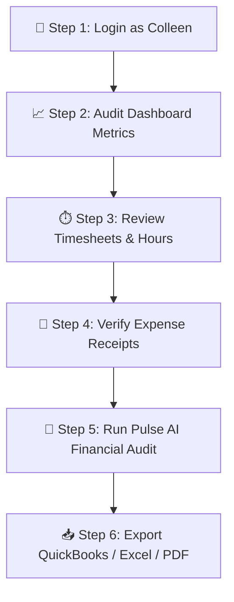

# 📑 IDS Pulse Accountant Visual Helpbook & Training Guide

Welcome to **IDS Pulse**! As an Accountant (Colleen's Role), your mission is to manage timesheets, verify field expense receipts, calculate representative billing, and export accurate financial records for corporate accounting and client invoicing.

---

## 🎨 1. Operational Overview

### 📊 End-to-End Accounting Workflow

---

## 🔑 2. Step 1 — Login & Portal Access

To access the Accountant Portal:

1. Open the [IDS Pulse Operations Suite](https://proud-lavoisier.vercel.app).
2. Enter the Accountant credentials:
   - **Username**: `colleen`
   - **Password**: `Colleen2026!`
3. Click **Authenticate**.

---

## 🖥️ 3. Step 2 — Understanding Your Accountant Dashboard

When logged in, your dashboard displays **4 Core Summary Metric Cards**:

| Metric Card | What it Tracks | How it's Calculated |
| :--- | :--- | :--- |
| **Total Billable Hours** | Cumulative QRE field hours | Sum of all representative shift entries |
| **Mileage Tracker** | Total travel kilometers / miles | Standard rate x logged travel distances |
| **Pending Expenses** | Claims submitted by field QREs | Fuel, tolls, parking, & meal receipts |
| **Grand Payroll / Invoice** | Total financial commitment | `(Hours x Rate) + Mileage + Expenses` |

---

## ⏱️ 4. Step 3 — Auditing Timesheets & Multi-Supplier Billing

Navigate to the **"Timesheets & Billing"** tab on your top menu bar.

- **Daily Hours**: Review representative clock-in / clock-out times.
- **Multi-Supplier Allocation**: Filter hours by Supplier (e.g. Auto Kabel, Magna, Hutchinson).
- **Manager Bulk Entry**: Use the Bulk Entry Sub-Tab to backdate or bulk-log hours for entire teams.

---

## 🧾 5. Step 4 — Verifying Field Expense Receipts

Field reps submit expenses directly from their mobile phones.

1. Scroll to the **Expense Verification Board**.
2. Click on the **Receipt Thumbnail Image** to open the high-resolution Lightbox Viewer.
3. Cross-check the receipt against the submitted dollar amount.
4. Click **Approve ✅** or **Flag for Correction ❌**.

---

## 🤖 6. Step 5 — Pulse AI Copilot Financial Audit

- Click the **Pulse AI Assistant** icon at the bottom right.
- Click **"Run Financial Audit"** to scan all database collections instantly.
- Pulse AI highlights rate discrepancies or missing receipts before you export reports.

---

## 📥 7. Step 6 — Exporting Reports & Invoices

- **QuickBooks CSV (`.csv`)**: Formatted for direct import into QuickBooks.
- **Styled Excel Ledger (`.xlsx`)**: Includes accounting borders and dynamic formulas.
- **PDF Client Invoice (`.pdf`)**: Official white-labeled invoice statement.

---

*IDS Pulse Operations Suite — Financial Accuracy, Audit Compliance, and Seamless Invoicing.*
