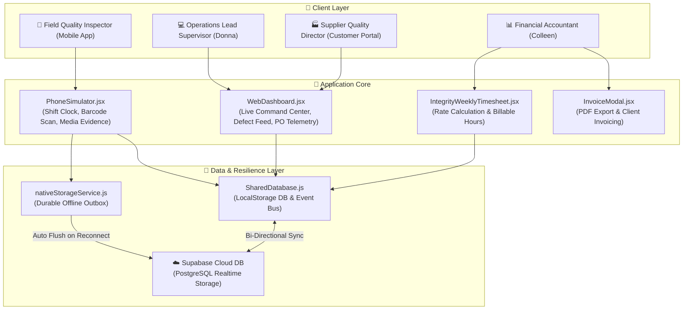
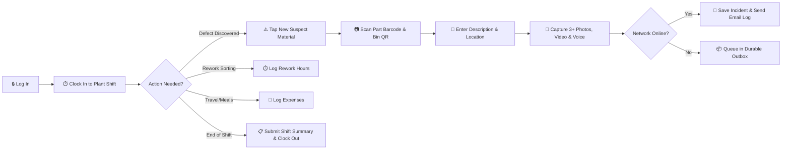
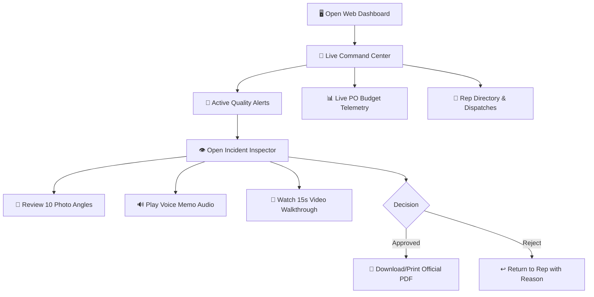
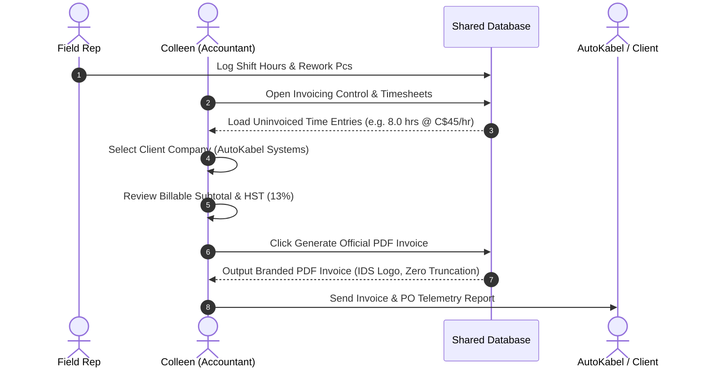

# IDS Pulse — System Architecture & User Flow Diagrams
**Integrity Driven Solutions Inc. (IDS)**

---

## 📍 Local HTML Infographic File
A fully interactive, styled HTML version of these diagrams is available locally at:
👉 [`docs/IDS_PULSE_SYSTEM_INFOGRAPHICS_AND_USER_FLOWS.html`](file:///C:/Users/Sharoz/Documents/antigravity/proud-lavoisier/docs/IDS_PULSE_SYSTEM_INFOGRAPHICS_AND_USER_FLOWS.html)

---

## 🏛️ 1. High-Level System Architecture



---

## 📱 2. Field Quality Inspector (Rep) Shift & Incident User Flow



### Steps Summary:
1. **Shift Onboarding**: Select plant (e.g. AutoKabel Windsor) and tap **CLOCK IN TO SHIFT**.
2. **Scan & Defect Log**: Scan part barcode and bin QR. Description & area discovery.
3. **Evidence Capture**: 3+ photos (Wide, Medium, Closeup), 15s MP4 video walkthrough, and voice note audio.
4. **Immediate Alert**: Tap **RELEASE INCIDENT REPORT**.
5. **Rework & Clock Out**: Log sorted pcs & rework hours, submit shift summary & clock out.

---

## 💻 3. Operations Lead Supervisor (Donna) Flow



---

## 📊 4. Financial Accountant (Colleen) Invoicing & Rates Flow



---

## ⚡ 5. Offline Resiliency & Data Sync Pipeline

```mermaid
flowchart TD
  A[📱 Rep Submits Incident/Report] --> B{Network Connected?}
  B -->|Online| C[☁️ Direct Upsert to Supabase DB]
  C --> D[✉️ Generate System Email Log]
  
  B -->|Offline| E[📦 nativeStorageService.stageIncidentLocally]
  E --> F[🆔 Generate Tracking Ref: LOCAL-INC-2026-XXXX]
  F --> G[💾 Store in localStorage Queue: ids_pulse_offline_queue]
  G --> H[🔔 Show Offline Confirmation Modal to Rep]

  H --> I[📡 Device Reconnects to Internet]
  I --> J[⚡ Trigger window.addEventListener('online')]
  J --> K[🔄 Execute flushOfflineQueue()]
  K --> L[☁️ Batch Upsert Queue to Supabase DB]
  L --> M[✅ Remove Synced Items from Local Outbox]
```

---

### Document Details
- **Platform**: IDS Pulse Quality & Operations Suite
- **Author**: Integrity Driven Solutions Inc.
- **Local File Path**: `docs/IDS_PULSE_SYSTEM_INFOGRAPHICS_AND_USER_FLOWS.md`
